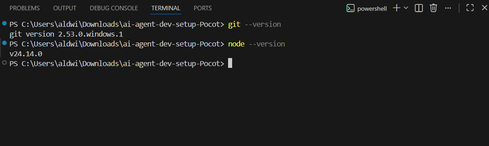

# AI Agent Developer Setup

**Name:** Aaron Josh M. Pocot  
**Workshop Cohort:** Full Stack Developer Cohort — March 2026 (Starting March 10, 2026)

---

## Development Environment Checklist

### ✅ Node.js Installed
Screenshot of `node --version` command:  

---

### ✅ Git Installed
Screenshot of `git --version` command:  

---

### ✅ VS Code Insider with GitHub Copilot Enabled
Screenshot showing VS Code Insider running with GitHub Copilot enabled:  

---

### ✅ Claude Desktop with All 4 MCP Servers Connected
Screenshot showing Claude Desktop open with all 4 MCP servers:  

---

## MCP Server Explanations

### 🎲 Rolldice
**Purpose:** Demonstrates and tests the tool-calling capability of AI agents.  
**Functionality:** Generates random dice roll values (1–6) to verify that Claude can successfully invoke external tools via MCP.

---

### 🤖 Bootcamp AI Agent
**Purpose:** Bootcamp-specific MCP server used for training exercises and AI workflow simulations.  
**Functionality:** Provides access to workshop resources and enables AI agent workflow simulations during the program.

---

### 📅 Calendar Booking
**Purpose:** Allows the AI assistant to create and manage calendar events on behalf of the user.  
**Functionality:** Creates calendar events, checks available times, and manages bookings through natural language prompts.

---

### 🐙 GitHub
**Purpose:** Allows Claude to interact directly with GitHub repositories using natural language.  
**Functionality:** Reads repository contents, assists with commits, manages issues, and helps with code review — all through Claude Desktop.

---

## Troubleshooting Notes

**Issue:** GitHub MCP server authentication error.  
**Solution:** Generated a personal access token from GitHub (Settings → Developer Settings → Personal Access Tokens) and added it to the MCP config file.

**Issue:** Node modules not installing properly.  
**Solution:** Reinstalled Node.js using the official installer and ran `npm install` again in the project directory.
