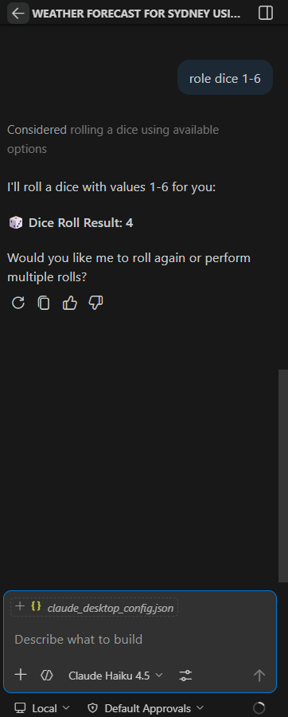
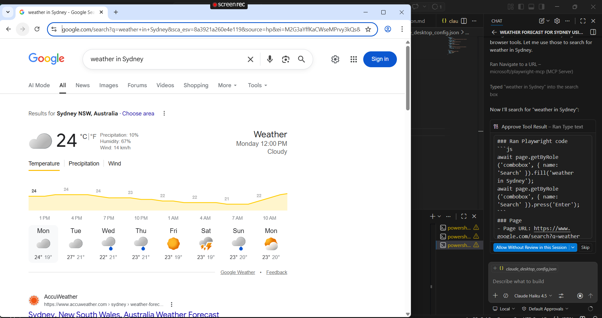
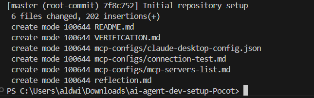

# Verification

## MCP Server Screenshots

### 🎲 Rolldice — Working in Claude Desktop

---

### 🤖 Bootcamp AI Agent — Server Working

---

### 📅 Calendar Booking — Server Working

---

### 🐙 GitHub MCP — Server Working

---

## GitHub MCP Usage Example

**Prompt given to Claude:**  
> "Read the files in my repository."

**Result:**  
Claude successfully accessed the repository via the GitHub MCP server and listed all files including `README.md`, `reflection.md`, `VERIFICATION.md`, and the `/mcp-configs/` folder contents.

---

## Git Commit History

The repository was built with meaningful commits showing a proper version control workflow:

1. `Initial repository setup`
2. `Added MCP configuration files`
3. `Added README with environment checklist and MCP explanations`
4. `Added reflection on AI Agent Developer mindset`
5. `Added verification screenshots and VERIFICATION.md`

